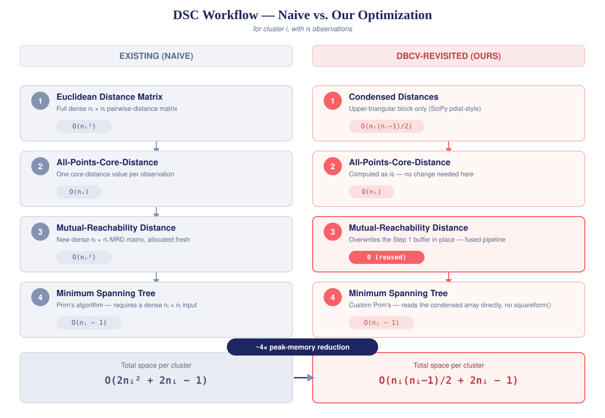
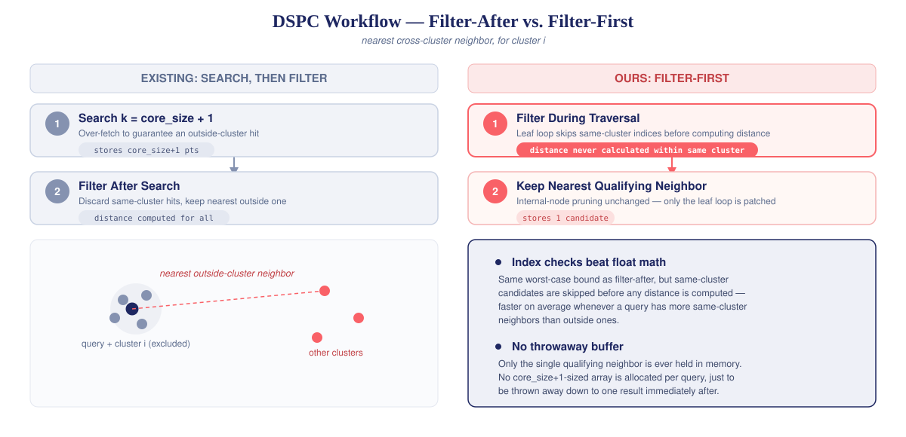
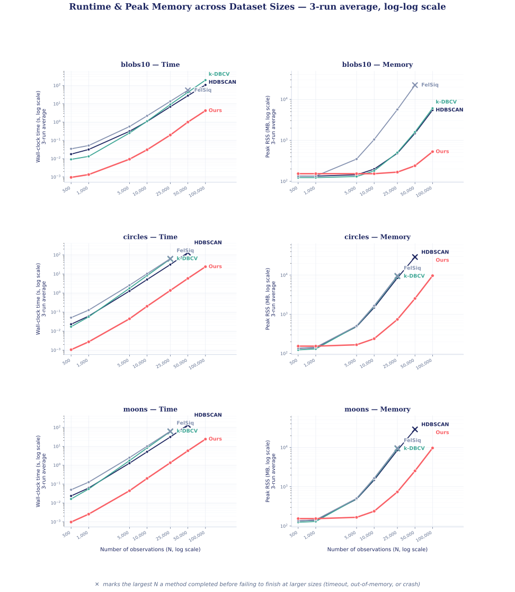
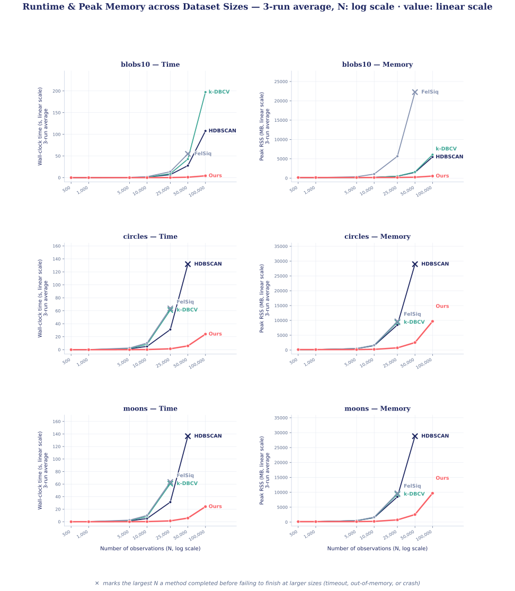

# DBCV-revisited

#### ⚡ *A Memory-Efficient, High-Performance Implementation of Density-Based Cluster Validation*

---

## Table of Contents

- [Why DBCV?](#why-dbcv)
- [Available Options](#available-options)
- [Our Contribution: DSC](#our-contribution-dsc)
- [Our Contribution: DSPC](#our-contribution-dspc)
- [How to Use](#how-to-use)
- [Time & Memory](#time--memory)
- [Score](#score)
- [Conclusion](#conclusion)
- [Appendix](#appendix)
- [References](#references)

---

## Why DBCV?

Think of ANOVA:

$$
\boldsymbol{F} =
\frac{
MS_{\text{between}}
}{
MS_{\text{within}}
}
$$

The underlying idea is simple: well-defined groups should exhibit low variation internally and clear separation from one another.

However, when groups have arbitrary shapes, a centroid may be a poor representation of the observations they contain. This is particularly relevant for density-based methods such as HDBSCAN, which can identify non-convex, elongated, and otherwise irregular structures. As a result, validity measures based on distances to cluster centroids may fail to capture their true geometry.

This is where **Density-Based Cluster Validation (DBCV)** comes in.

DBCV follows the same fundamental principle of balancing internal compactness against external separation, but does so without assuming a particular geometric shape. It constructs a **Minimum Spanning Tree (MST)** for each group to characterize its internal density structure via the maximum-weight edge, and uses cross-MST distances to quantify the separation between groups.

For a clustering of dataset $\mathcal{X}$ into clusters $C_1, \dots, C_l$:

$$
\mathbf{DBCV}(\mathcal{X}) = \sum_{i=1}^{l} \frac{|C_i|}{|\mathcal{X}|} \, \mathbf{V_C}(C_i)
$$

where the validity of a single cluster $C_i$ balances its internal sparseness against its separation from the nearest other cluster:

$$
\boxed{
\boldsymbol{
V_C(C_i) =
\frac{
\min\limits_{j \neq i} \text{DSPC}(C_i, C_j) - \text{DSC}(C_i)
}{
\max\left(
\min\limits_{j \neq i} \text{DSPC}(C_i, C_j),
\text{DSC}(C_i)
\right)
}
}
}
$$

$\text{DSC}(C_i)$ (Density Sparseness of a Cluster) and $\text{DSPC}(C_i, C_j)$ (Density Separation of a Pair of Clusters) are exactly the two MST-derived quantities named above — how we compute each is covered in our own contributions below. $|\mathcal{X}|$ includes noise points (they contribute $0$ to the sum, via no $C_i$ of their own), so a clustering that leaves more points unclassified as noise cannot inflate its score by only counting the points it did assign.

**DBCV** was originally proposed by **[Moulavi et al. (2014)](#references)**, as an improvement over the then widely used multi-representative-based **CDbw** index [(Halkidi & Vazirgiannis, 2008)](#references). Subsequent comparative studies have shown that DBCV can outperform competing density-based validity indices and exhibit robust performance across a wide range of clustering scenarios, particularly for **non-globular, concave, and density-based structures** [[Chicco et al., 2025](#references); [Simpson et al., 2026](#references)].

This makes DBCV particularly well suited to evaluating methods such as **HDBSCAN**, where density, rather than geometric shape, is central to how groups are identified.

## Available Options

*hdbscan · kdbcv · felsiq — a brief survey*

The time and space complexity of DBCV scales quadratically with the number of observations, which limits its adoption for large datasets.

The available CRAN implementation, [`dbscan`](https://CRAN.R-project.org/package=dbscan), explicitly acknowledges this limitation in its documentation:

> **Performance note:** This implementation calculates a distance matrix and thus can only be used for small or sampled datasets.

In Python, three notable implementations are:

1. **[`HDBSCAN` — `validity_index`](https://hdbscan.readthedocs.io/en/latest/_modules/hdbscan/validity.html#validity_index)**
   Bundled with the widely used HDBSCAN package, this implementation uses an efficient Cython routine for MST construction. However, it explicitly materializes dense pairwise mutual-reachability matrices for **density sparseness (DSC)** and dense cross-cluster distance/MRD matrices for **density separation (DSPC)**.
2. **[`FelSiq/DBCV`](https://github.com/FelSiq/DBCV)**
   This vanilla implementation is designed to be "fully compatible with the original MATLAB implementation" and is commonly used in academic comparisons and benchmarks.
3. **[`k-DBCV`](https://github.com/Kaufman-Lab-Columbia/k-DBCV)**
   This implementation introduces a KD-tree-based spatial partitioning strategy in place of brute-force nearest-neighbor search. During our review, however, we identified an implementation inconsistency, which is documented in [Issue #3](https://github.com/Kaufman-Lab-Columbia/k-DBCV/issues/3) and was brought to the author's attention.

## Our Contribution: DSC

*Density Sparseness of a Cluster*

The typical workflow for DSC is, for each cluster $i$:

**Step 1:** Computes the Euclidean distance matrix
&nbsp;&nbsp;&nbsp;&nbsp;Incremental memory: $O(n_i^2)$

**Step 2:** Computes the all-points-core-distance array
&nbsp;&nbsp;&nbsp;&nbsp;Incremental memory: $O(n_i)$

**Step 3:** Computes the mutual-reachability distance
&nbsp;&nbsp;&nbsp;&nbsp;Incremental memory: $O(n_i^2)$

**Step 4:** Computes the minimum spanning tree
&nbsp;&nbsp;&nbsp;&nbsp;Incremental memory: $O(n_i-1)$

We have made the following optimizations:

**Step 1:**
Computes only the upper-triangular block of the Euclidean distance matrix and stores it in a condensed array format (see SciPy's [`pdist`](https://docs.scipy.org/doc/scipy/reference/generated/scipy.spatial.distance.pdist.html)). The distance matrix is symmetric by definition, with zero-valued diagonals, so there is no reason to ever materialize the full matrix.
&nbsp;&nbsp;&nbsp;&nbsp;Incremental memory: $O(n_i(n_i-1)/2)$

**Step 2:**
Computes the all-points-core-distance array as is.
&nbsp;&nbsp;&nbsp;&nbsp;Incremental memory: $O(n_i)$

**Step 3:**
The Euclidean and mutual-reachability distance matrices have exactly the same shape, and the argument about diagonal symmetry still holds. We update the allocation from Step 1 in place.
&nbsp;&nbsp;&nbsp;&nbsp;Incremental memory: $0$

**Step 4:**
Computes the minimum spanning tree. The available HDBSCAN implementations of Prim's algorithm only accept a full $n_i \times n_i$ distance matrix.
So, we customized the algorithm from scratch to work directly with the condensed array from Step 3, without ever materializing it using [`squareform`](https://docs.scipy.org/doc/scipy/reference/generated/scipy.spatial.distance.squareform.html).
&nbsp;&nbsp;&nbsp;&nbsp;Incremental memory: $O(n_i-1)$



So, the total space complexity per cluster is reduced from $O(2n_i^2+2n_i-1)$ to $O(n_i(n_i-1)/2+2n_i-1)$. Although both are quadratic, this gives an approximately **4× peak-memory reduction** in the constant factor for large $n_i$, theoretically guaranteed even before applying any other optimization.

**Note:** There is no free lunch. By adding an extra layer of index manipulation in the $O(n_i^2)$ hot loop of Prim's algorithm, our customized MST routine should run slower than a generic MST builder when considered in isolation.
However, we have optimized the complete DBCV workflow tightly enough to absorb those extra seconds and achieve a net positive runtime improvement.

## Our Contribution: DSPC

*Density Separation of a Pair of Clusters*

For DSPC, we adopt a KD-tree approach to avoid materializing cross-cluster matrices during the loop.

The tree is built from the combined data of core points from all clusters, and we need to find the nearest neighbor of a point outside its own cluster.

So, the typical workflow for cluster $i$ is:

**Step 1:** Find `#cluster_core_size + 1` neighbors for each point to ensure at least one outside-cluster neighbor.

**Step 2:** Discard the same-cluster neighbors and retain only the closest outside-cluster neighbor using index filtering; we already know which observation ID belongs to which cluster.

Here, we patch the brute-force loop on the leaf nodes of the query routine to perform the index filtering **before** distance calculation. The internal-node tree traversal remains the same.



This modification gives us the following benefits:

1. **Index comparison is always cheaper than floating-point distance computation.**
   When we know in advance that a same-cluster observation is not required downstream, we can short-circuit the iteration without ever performing the distance arithmetic.
   The worst-case upper bound for Step 1 + Step 2 remains the same, because we are performing the same task, just in a different order. However, in most cases, where a query point is surrounded by more same-cluster observations than outside-cluster observations, this reduces the average runtime.
2. **We no longer need to store `#cluster_core_size + 1` neighbors per query in an intermediate array**, only to discard all but one.

## How to Use

```bash
git clone https://github.com/idnantimar/DBCV-revisited.git
cd DBCV-revisited
pip install .
```

Overall score only:

```python
from sklearn.datasets import make_blobs
from DBCV import DBCV_score

X, y = make_blobs(n_samples=500, centers=4, random_state=0)
score = DBCV_score(X, y)
```

With `per_cluster_scores=True`, you additionally get each cluster's own contribution back as an array, alongside the overall score:

```python
score, cluster_scores = DBCV_score(X, y, per_cluster_scores=True)
```

Beyond the top-level `DBCV_score`, we've also built and exposed two standalone utilities under `DBCV.utils`, usable independently of DBCV itself:

1. **MST** (`mst_linkage_core_condensed`) — Prim's algorithm operating directly on a condensed (upper-triangular) distance array, with no `squareform` step ever required.
2. **KDTree** (`cKDTree`) — a `scipy.spatial.cKDTree` fork with traversal-level, index-based neighbor filtering, so cross-cluster nearest-neighbor queries never pay for a same-cluster distance calculation.

```python
from DBCV.utils import mst_linkage_core_condensed, cKDTree
```

## Time & Memory

*Wall-clock time and peak RSS, scaling from 500 to 100,000 points*



The log-log view above is the right one for reading exact scaling behavior at every size. Keeping N on a log scale (so the smaller sizes stay readable) but switching the value axis to linear makes the gap even more visually stark — the other three methods shoot upward while ours stays pinned near zero across the same range:



## Score

*Agreement with felsiq's reference implementation*

Score for each dataset, method, and run, across all sizes. `kdbcv` is excluded here — see [Available Options](#available-options) for the implementation issue we found and reported ([Issue #3](https://github.com/Kaufman-Lab-Columbia/k-DBCV/issues/3)); it remains in the [Time & Memory](#time--memory) benchmarks above since that issue doesn't affect runtime/memory measurement.

### blobs10

<!-- SCORE_TABLE:blobs10 START -->
<table>
<thead>
<tr><th>method</th><th>run</th><th align="right">500</th><th align="right">1,000</th><th align="right">5,000</th><th align="right">10,000</th><th align="right">25,000</th><th align="right">50,000</th><th align="right">100,000</th></tr>
</thead>
<tbody>
<tr><td rowspan="3">Ours</td><td>1</td><td align="right">0.471676</td><td align="right">0.159922</td><td align="right">0.032993</td><td align="right">-0.155677</td><td align="right">-0.350667</td><td align="right">-0.320743</td><td align="right">-0.388716</td></tr>
<tr><td>2</td><td align="right">0.393145</td><td align="right">0.369820</td><td align="right">-0.048403</td><td align="right">-0.140218</td><td align="right">-0.263146</td><td align="right">-0.396820</td><td align="right">-0.388716</td></tr>
<tr><td>3</td><td align="right">0.556961</td><td align="right">0.094470</td><td align="right">0.134878</td><td align="right">0.013771</td><td align="right">-0.229369</td><td align="right">-0.319273</td><td align="right">-0.388716</td></tr>
<tr><td rowspan="3">HDBSCAN</td><td>1</td><td align="right">0.342005</td><td align="right">0.077528</td><td align="right">-0.098594</td><td align="right">-0.414285</td><td align="right">-0.453398</td><td align="right">-0.489233</td><td align="right">-0.641142</td></tr>
<tr><td>2</td><td align="right">0.255302</td><td align="right">0.230741</td><td align="right">-0.269673</td><td align="right">-0.293055</td><td align="right">-0.367287</td><td align="right">-0.620205</td><td align="right">-0.641142</td></tr>
<tr><td>3</td><td align="right">0.427322</td><td align="right">0.012976</td><td align="right">-0.134381</td><td align="right">-0.147638</td><td align="right">-0.487128</td><td align="right">-0.431217</td><td align="right">-0.641142</td></tr>
<tr><td rowspan="3">FelSiq</td><td>1</td><td align="right">0.471676</td><td align="right">0.159922</td><td align="right">0.032993</td><td align="right">-0.155677</td><td align="right">-0.350667</td><td align="right">-0.320743</td><td align="right">NA</td></tr>
<tr><td>2</td><td align="right">0.393145</td><td align="right">0.369820</td><td align="right">-0.048403</td><td align="right">-0.140218</td><td align="right">-0.263146</td><td align="right">-0.396820</td><td align="right">NA</td></tr>
<tr><td>3</td><td align="right">0.556961</td><td align="right">0.094470</td><td align="right">0.134878</td><td align="right">0.013771</td><td align="right">-0.229369</td><td align="right">-0.319273</td><td align="right">NA</td></tr>
</tbody>
</table>
<!-- SCORE_TABLE:blobs10 END -->

### circles

<!-- SCORE_TABLE:circles START -->
<table>
<thead>
<tr><th>method</th><th>run</th><th align="right">500</th><th align="right">1,000</th><th align="right">5,000</th><th align="right">10,000</th><th align="right">25,000</th><th align="right">50,000</th><th align="right">100,000</th></tr>
</thead>
<tbody>
<tr><td rowspan="3">Ours</td><td>1</td><td align="right">0.852832</td><td align="right">0.929685</td><td align="right">0.966851</td><td align="right">0.968470</td><td align="right">0.986505</td><td align="right">0.989319</td><td align="right">0.990307</td></tr>
<tr><td>2</td><td align="right">0.838167</td><td align="right">0.928815</td><td align="right">0.980886</td><td align="right">0.938114</td><td align="right">0.986037</td><td align="right">0.989340</td><td align="right">0.990307</td></tr>
<tr><td>3</td><td align="right">0.879361</td><td align="right">0.938497</td><td align="right">0.982724</td><td align="right">0.983148</td><td align="right">0.990684</td><td align="right">0.984710</td><td align="right">0.990307</td></tr>
<tr><td rowspan="3">HDBSCAN</td><td>1</td><td align="right">0.821221</td><td align="right">0.902565</td><td align="right">0.916952</td><td align="right">0.944469</td><td align="right">0.949026</td><td align="right">0.928348</td><td align="right">NA</td></tr>
<tr><td>2</td><td align="right">0.803025</td><td align="right">0.888394</td><td align="right">0.913532</td><td align="right">0.914954</td><td align="right">0.945142</td><td align="right">0.963527</td><td align="right">NA</td></tr>
<tr><td>3</td><td align="right">0.869090</td><td align="right">0.869601</td><td align="right">0.905527</td><td align="right">0.908973</td><td align="right">0.934511</td><td align="right">0.938836</td><td align="right">NA</td></tr>
<tr><td rowspan="3">FelSiq</td><td>1</td><td align="right">0.852832</td><td align="right">0.929685</td><td align="right">0.966851</td><td align="right">0.968470</td><td align="right">0.986505</td><td align="right">NA</td><td align="right">NA</td></tr>
<tr><td>2</td><td align="right">0.838167</td><td align="right">0.928815</td><td align="right">0.980886</td><td align="right">0.938114</td><td align="right">0.986037</td><td align="right">NA</td><td align="right">NA</td></tr>
<tr><td>3</td><td align="right">0.879361</td><td align="right">0.938497</td><td align="right">0.982724</td><td align="right">0.983148</td><td align="right">0.990684</td><td align="right">NA</td><td align="right">NA</td></tr>
</tbody>
</table>
<!-- SCORE_TABLE:circles END -->

### moons

<!-- SCORE_TABLE:moons START -->
<table>
<thead>
<tr><th>method</th><th>run</th><th align="right">500</th><th align="right">1,000</th><th align="right">5,000</th><th align="right">10,000</th><th align="right">25,000</th><th align="right">50,000</th><th align="right">100,000</th></tr>
</thead>
<tbody>
<tr><td rowspan="3">Ours</td><td>1</td><td align="right">0.927630</td><td align="right">0.962210</td><td align="right">0.977990</td><td align="right">0.946061</td><td align="right">0.951122</td><td align="right">0.968099</td><td align="right">0.943718</td></tr>
<tr><td>2</td><td align="right">0.812001</td><td align="right">0.950442</td><td align="right">0.972039</td><td align="right">0.932396</td><td align="right">0.969615</td><td align="right">0.962388</td><td align="right">0.943718</td></tr>
<tr><td>3</td><td align="right">0.870649</td><td align="right">0.944222</td><td align="right">0.964620</td><td align="right">0.967344</td><td align="right">0.969883</td><td align="right">0.960091</td><td align="right">0.943718</td></tr>
<tr><td rowspan="3">HDBSCAN</td><td>1</td><td align="right">0.908103</td><td align="right">0.919840</td><td align="right">0.916817</td><td align="right">0.882063</td><td align="right">0.856270</td><td align="right">0.937653</td><td align="right">NA</td></tr>
<tr><td>2</td><td align="right">0.779274</td><td align="right">0.898611</td><td align="right">0.859675</td><td align="right">0.886591</td><td align="right">0.918802</td><td align="right">0.899988</td><td align="right">NA</td></tr>
<tr><td>3</td><td align="right">0.837085</td><td align="right">0.893408</td><td align="right">0.915756</td><td align="right">0.908876</td><td align="right">0.939650</td><td align="right">0.883943</td><td align="right">NA</td></tr>
<tr><td rowspan="3">FelSiq</td><td>1</td><td align="right">0.927630</td><td align="right">0.962210</td><td align="right">0.977990</td><td align="right">0.946061</td><td align="right">0.951122</td><td align="right">NA</td><td align="right">NA</td></tr>
<tr><td>2</td><td align="right">0.812001</td><td align="right">0.950442</td><td align="right">0.972039</td><td align="right">0.932396</td><td align="right">0.969615</td><td align="right">NA</td><td align="right">NA</td></tr>
<tr><td>3</td><td align="right">0.870649</td><td align="right">0.944222</td><td align="right">0.964620</td><td align="right">0.967344</td><td align="right">0.969883</td><td align="right">NA</td><td align="right">NA</td></tr>
</tbody>
</table>
<!-- SCORE_TABLE:moons END -->

*Ours and FelSiq match to the displayed precision in every run, at every size, on every dataset — the residual (visible only past the 10th–12th decimal, not shown here) is floating-point/compiler-level noise, not an algorithmic difference.*

**NA** marks a run that did not finish at that size (timeout, out-of-memory, or crash) — same convention as the ✕ markers in [Time & Memory](#time--memory).

These tables are generated directly from `summary/<dataset>/score.csv` by `generate_score_tables.py` — never hand-edited. To refresh after a new benchmark run, or to add/remove a method or dataset, edit the constants at the top of that script and re-run it; it rewrites only the content between each `SCORE_TABLE` marker pair above, leaving the rest of this file untouched.

## Conclusion

---

## Appendix

### Numerical Stability of APCD

For a point $x$ in cluster $C_i$ (with $|C_i| = n_i$ points and $d$ features), the all-points core distance is:

$$
\text{APCD}(x) = \left( \frac{1}{n_i - 1} \sum_{\substack{y \in C_i \\ y \neq x}} \left( \|x - y\|^2 \right)^{-d} \right)^{-1/d}
$$

and the mutual-reachability distance between two points is:

$$
\text{MRD}(x, y) = \max\left( \|x - y\|^2,\ \text{APCD}(x),\ \text{APCD}(y) \right)
$$

where $\|x-y\|^2$ is squared-Euclidean distance — the paper by Moulavi et al. (2014) specifies squared-Euclidean rather than ordinary Euclidean distance here, since it assigns proportionally greater weight to closer neighbors in the APCD sum.

`float64` represents values from `4.94e-324` to `1.80e+308`. Since $\|x-y\|^2$ is raised to the power $-d$, both ends of that range are reachable long before $d$ gets large:

**Case 1 — $\|x-y\|^2$ at or near exact zero.** $\left(\|x-y\|^2\right)^{-d}$ overflows to $+\infty$, so the sum inside the outer parentheses is dominated by that single $\infty$ term, and $\infty^{-1/d} = 0$. Two points with no practically meaningful distance between them collapse `APCD` to `0` for both — which is the intended behavior for duplicate (or near-duplicate) points, not a bug.

Collapses to `0` once:

| $d$ | $\|x-y\|^2 <$ |
|---:|---:|
| 50 | `3.42e-07` |
| 25 | `1.17e-13` |
| 10 | `4.67e-33` |

**Case 2 — $\|x-y\|^2$ extremely large.** $\left(\|x-y\|^2\right)^{-d}$ underflows to exactly `0`. If *every* other point in the cluster is far enough from $x$ to trigger this, the entire sum underflows to `0`, and $0^{-1/d} = +\infty$ — `APCD(x)` becomes infinite for that point. This is the expected behavior for an extreme outlier, not a bug.

Collapses to `+∞` once every neighbor satisfies:

| $d$ | $\|x-y\|^2 >$ |
|---:|---:|
| 50 | `1.46e+06` |
| 25 | `2.14e+12` |
| 10 | `6.69e+30` |

(All six thresholds above are exact: the smallest positive `float64` subnormal is `4.9406564584124654e-324` and the largest finite `float64` is `1.7976931348623157e+308`; the table entries are $\left(4.9406564584124654 \times 10^{-324}\right)^{1/d}$ and $\left(1.7976931348623157 \times 10^{308}\right)^{1/d}$ respectively — re-derived and checked against the code's observed behavior, not copied from the source comment.)

At $d = 50$, the collapse range starts at a squared distance of only `3.42e-07` — well within the range of ordinary, non-duplicate points on real data, meaning legitimate close-but-distinct neighbors risk being silently treated as duplicates. At $d = 25$, the range is narrow enough (`1.17e-13` to `2.14e+12`) to stay clear of typical data. This `float64` implementation is reliable up to roughly $d \le 25$. Beyond that, the same APCD accumulation logic would need reimplementing in `float128` (NumPy's extended-precision floating type) to push these collapse thresholds back out to a safe range.

---

## References

- Moulavi, D., Jaskowiak, P. A., Campello, R. J. G. B., Zimek, A., & Sander, J. (2014). Density-based clustering validation. In *Proceedings of the 2014 SIAM International Conference on Data Mining* (pp. 839–847). SIAM.

- Halkidi, M., & Vazirgiannis, M. (2008). A density-based cluster validity approach using multi-representatives. *Pattern Recognition Letters*, *29*(6), 773–786.

- Chicco, D., Sabino, G., Oneto, L., & Jurman, G. (2025). The DBCV index is more informative than DCSI, CDbw, and VIASCKDE indices for unsupervised clustering internal assessment of concave-shaped and density-based clusters. *PeerJ Computer Science*, *11*, e3095.

- Simpson, C., Campello, R. J. G. B., & Stojanovski, E. (2026). Benchmarking of clustering validity measures revisited. *Statistical Analysis and Data Mining: An ASA Data Science Journal*, *19*(1), e70061.
